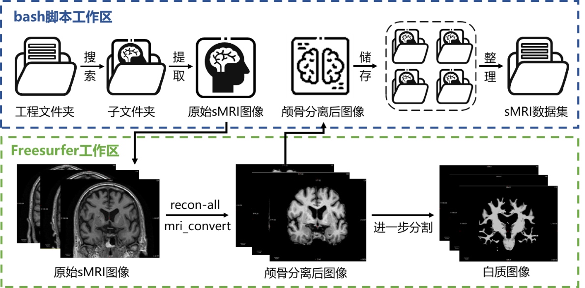
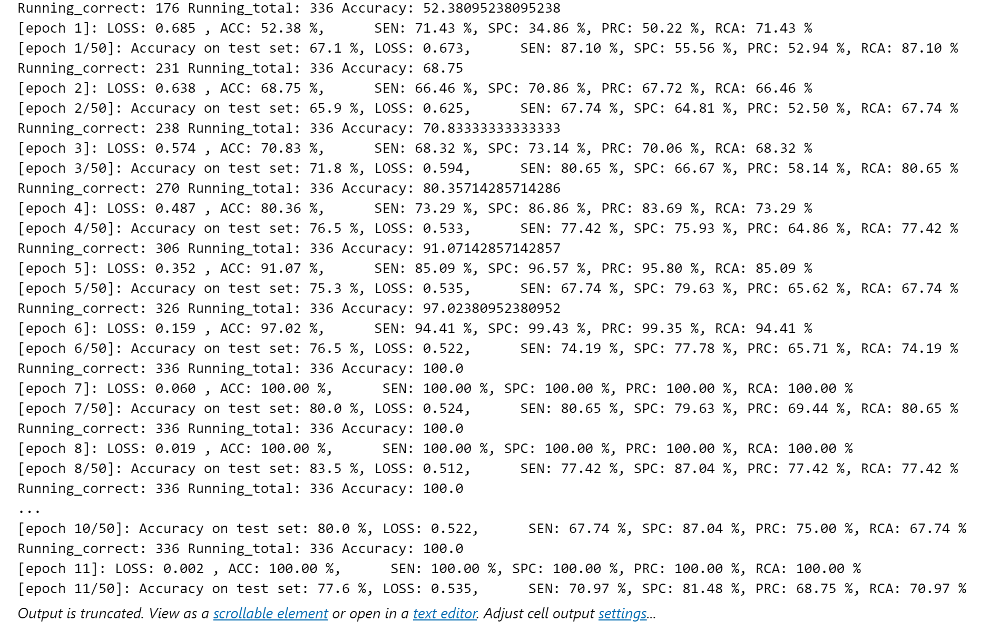
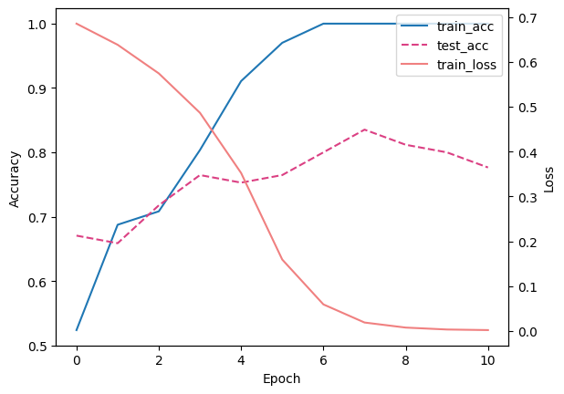
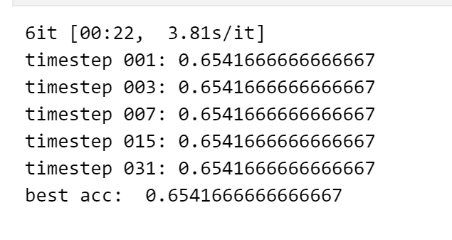
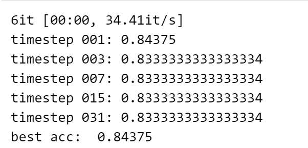

## 1. 概述

### 1.1 选题背景

阿尔兹海默症（Alzheimer's disease, AD）是一种不可逆的神经退行性疾病，是痴呆症中患病率最高的类型，通常表现为短期记忆困难并严重影响患者的日常活动，对患者家庭造成了巨大的经济负担。而AD的治疗仅限于延缓一些症状的发生，如记忆丧失、思维混乱等认知问题，如果能够进行早期的预防、诊断和干预治疗，将延缓病情的发展。当前，结构性磁共振成像（sMRI）被广泛应用于临床AD诊断中，通过施加磁场与质子共振获得脑内三维结构影像，并基于海马体、杏仁核、扣回带等结构的形态和大小对AD进行诊断，因此，本项目聚焦于使用sMRI的AD诊断任务，探究三维卷积神经网络（如3D-VGGNet）向脉冲神经网络(SNN)转化的潜力。

### 1.2 项目特色

与网上可查的相关项目不同的是，本项目并未沿用Braincog库中样例已有的将VGG16转化为SNN的框架，像其他项目一样设计更加复杂的SNN测试任务和场景，而是从新维度、新模型、新场景出发，针对**三维图像分类**的新维度、**3D-VGGNet**的新模型、**基于sMRI的AD诊断**的新任务，对Braincog库的ANN2SNN模块进行应用与可行性测试，依次探究了将三维卷积神经网络整体转化为脉冲神经网络，以及先将三维卷积神经网络进行拆分，对其中部分模块转化为脉冲神经网络后再将网络重新组合的分类效果。

### 1.3 项目设计流程

项目的设计流程主要包括以下三个步骤：
1. 步骤一：对ADNI 1数据库中被试信息进行整理，构建3D-VGGNet实现阿尔兹海默症的诊断（AD vs Cognitive Normal），形成基础模型；
2. 步骤二：首先尝试直接使用Braincog库中的转换模块将3D-VGGNet转化为三维脉冲神经网络，发现效果不佳（模型始终分类为CN），我们初步判断是转换模块对于三维标准化层的处理方式存在优化的可能；
3. 步骤三：为解决步骤二效果不佳的问题，本项目先将3D-VGGNet拆分成特征提取器和分类器，只将其中的分类器转化为脉冲神经网络，继而将两个网络部分重新组合并测试，实现了和3D-VGG相似的准确率。

### 1.4 文件排布

- **3DSNN_AD_diagnose**（项目工程总文件夹）
  - **ADdiag**（基于sMRI的AD诊断模型：3D-VGGNet转化为SNN的可行性探究）
    - `data`：项目数据文件夹，包括ADNI 1数据库中的被试sMRI图像、流行病学调查、查体等数据。
    - `model`：用于储存训练后的基础ANN模型。
    - `result`：一些项目相关的简单绘图，更多的实验结果可在程序jupyter文档中直观查看。
    - `main1_3DVGGNettraining.ipynb`：三维VGGNet神经网络训练代码与结果。
    - `main2_VGG2SNN`：实验一，将3D-VGGNet整体转化为SNN的代码与结果。
    - `main3_VGG2SNN_拆分`：实验二，将3D-VGGNet依次拆分、转化、合并转化为SNN的代码与结果。
  - **Brain-cog-main**（Braincog库工程文件夹）

---

## 2. 使用方法

### 2.1 数据预处理

本研究对结构性磁共振成像（sMRI）图像采用了两步预处理方法：（data中的数据已完成，无需进行）
1. **颅骨剥离（Skull Stripping）**：基于FreeSurfer软件包，旨在移除sMRI影像中的非大脑组织（包括皮肤、肌肉、颅骨等），仅留下大脑组织以供分析。
2. **图像配准（Registration）**：基于FSL软件包，旨在将个体的sMRI影像与标准化大脑模板对齐，确保不同个体的图像可以在统一的参考框架内进行比较。

同时，为解决预处理过程中遇到的软件包兼容性问题，本研究将使用Ubuntu 18.04操作系统，编写bash脚本来批量自动化完成所有sMRI原始图像的预处理工作。

图1：基于Freesurfer的sMRI影像颅骨分离方法工作流图

图 2 配准前后的sMRI影像

图中四列依次代表原始sMRI影像、MNI 152模板、6自由度刚性配准图像和12自由度仿射配准图像，三行分别表示大脑矢状面、冠状面和水平面。

### 2.2 构建3D-VGGNet基础模型实现阿尔兹海默症的诊断

点击jupyter文档中的全部运行按钮，运行main1_3DVGGNettraining.ipynb

### 2.3 实验一：将3D-VGGnet整体转化为SNN并测试性能实验

点击jupyter文档中的全部运行按钮，运行main2_VGG2SNN.ipynb

### 2.4 实验二：将3D-VGGnet依次拆分、转化、合并转化为SNN 并测试性能实验

点击jupyter文档中的全部运行按钮，运行main3_ VGG2SNN_拆分.ipynb

---

## 3. 模型效果展示

### 第一阶段：构建3D-VGGNet基础模型实现阿尔兹海默症的诊断
3D-VGGNet的训练过程如下，可以进一步在main1_3DVGGNettraining.ipynb中进行详细查阅

下图为训练过程的误差与准确率变化曲线，由于sMRI数据集较小，因此模型收敛速度较快且存在一定的过拟合现象

### 第二阶段：将3D-VGGnet整体转化为SNN并测试性能实验

将3D-VGGNet整体转化为SNN并进行测试集性能测试可得到如下所示结果，可以看出可能由于三维Maxpooling以及BatchNormalization等结构的特殊性，导致转化的效果较差，模型始终预测为一个值。

### 第三阶段：将3D-VGGnet依次拆分、转化、合并转化为SNN 并测试性能实验

为解决第二阶段所遇到的问题，本项目先将3D-VGGNet拆分成特征提取器和分类器，只将其中的分类器转化为脉冲神经网络，继而将两个网络部分重新组合并测试，可得到如下所示测试结果：

可以发现，在本方法下，3D-VGGNet的转化效果较好，得到了超越3D-VGGNET的84.375%准确率。

---

## 成员分工

- **黄想**：整体项目的架构、参与各模块核心程序编写、项目说明底稿
- **赵嘉盈**：构思项目场景，获取数据并设置训练标签
- **吕泽权**：使用Freesurfer、FSL软件完成sMRI数据的预处理
- **张宝月**：设计3D-VGGNet和3D-ResNet等基础模型实现AD的诊断
- **李月美**：负责将3D-VGGnet整体转化为SNN并完成测试性能实验
- **吴广鑫**：负责将3D-VGGnet依次拆分、转化、合并转化为SNN 并完成测试性能实验

